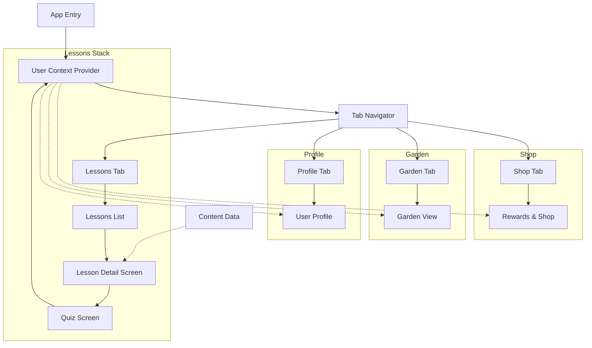

# Gemini Project Notes

This file is for tracking Gemini-related tasks, prompts, and documentation for the Papaya project. Use this file to pick up context between sessions.

## Current State (Jan 21, 2026)
- **App Status**: Functional. All lessons should be working.
- **Recent Focus**: Fixing broken lessons and addressing type errors.

## Recent Changes
1.  **Sustainable Living Lesson Fixes**:
    *   Implemented missing content and navigation logic for "Sustainable Living", "Sustainable Living: Reduce Waste", and "Sustainable Living: Energy Efficiency" in `app/screens/LessonDetailScreen.tsx`.
    *   Connected these lessons to the Quiz flow.
2.  **Bug Fixes**:
    *   Removed unused `getRecyclingContentAndButton` function in `LessonDetailScreen.tsx` that was causing reference errors.
    *   Fixed `HapticTab` component in `app/(tabs)/index.tsx` to correctly handle `accessibilityState` and optional `onPress` props, resolving TypeScript errors.

## Next Steps / Backlog
- [ ] Verify all other lessons have correct content mappings (completed for Sustainable Living).
- [ ] Add more interactive elements to lessons?
- [ ] Review `LessonDetailScreen.tsx` for further refactoring (large conditional blocks could be improved).

## App Overview
Here is the high-level architecture and navigation flow of the Papaya app:

