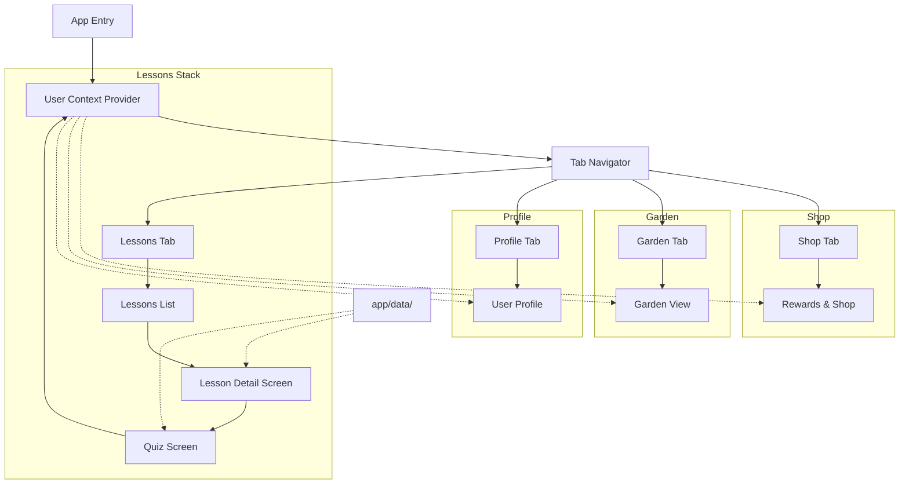

# Gemini Project Notes

This file is for tracking Gemini-related tasks, prompts, and documentation for the Papaya project. Use this file to pick up context between sessions.

## Current State (Jan 24, 2026)
- **App Status**: Functional. 19 lessons across 7 categories, Crafting Kitchen implemented, Garden system active.
- **Recent Focus**: Adding new lessons (Nuclear Energy, Deserts & Geo-engineering, Amazing Animals), Supabase auth integration for user progress sync.

## Recent Changes
1.  **New Lesson Content**:
    *   **Nuclear Energy**: Covers controversies, historical disasters, benefits as clean energy, and future technologies (SMRs, Fusion).
    *   **Deserts & Geo-engineering**: Explores desertification and global greening efforts.
    *   **Amazing Animals**: Fun facts about animal adaptations to climate change.
    *   **Urban Living**: Environmental impact of cities and urbanization trends.
    *   **Public Transport & Urban Living**: Sustainable cities and transport emissions.
    *   **Policy & Environmental Laws**: Multi-step lesson on international frameworks and US legislation.
2.  **Crafting Kitchen**:
    *   Users craft items (Green Salad, Floral Bouquet, Mythical Garden Set).
    *   Ingredients pulled from user inventory (harvested from garden).
    *   Crafted items sold for coins.
3.  **Quiz Screen Redesign**:
    *   Modern, clean UI (white background, pill-style options, blue accent button).
4.  **Landing Page Polish**:
    *   Refined layout, clear value proposition, removed emojis for professional look.
5.  **User Progress Sync** (In Progress):
    *   Supabase integration for cross-device progress synchronization.

## Project Structure
```
app/
├── components/
│   ├── crafting/       # Crafting components
│   │   └── CraftingArea.tsx
│   └── quiz/           # Quiz-specific components
│       ├── QuizCard.tsx
│       ├── QuizOptions.tsx
│       └── SeedAnimations.tsx
├── contexts/
│   └── UserContext.tsx  # User state (seeds, garden, inventory)
├── data/
│   ├── contentData.tsx  # Lesson content text (19 lessons)
│   ├── craftingRecipes.ts # Crafting recipes
│   ├── lessons.ts       # Lesson definitions (19 total)
│   └── quizQuestions.ts # All quiz questions
├── screens/
│   ├── GardenScreen.tsx
│   ├── GlobalEnergyMixScreen.tsx
│   ├── LessonDetailScreen.tsx
│   ├── LessonsScreen.tsx
│   ├── ProfileScreen.tsx
│   ├── QuizScreen.tsx
│   ├── RewardsScreen.tsx
│   └── SustainableLivingScreen.tsx
└── types/
    ├── crafting.ts      # Crafting recipes & items
    ├── garden.ts        # GardenItem, InventoryItem
    ├── lesson.ts        # Lesson
    └── quiz.ts          # Question, QuizData
```

## Lesson Categories
- **Climate Fundamentals** (2): Climate Basics, Carbon Footprint
- **Energy** (4): Energy Mix, Solar Power, Renewable Energy, Nuclear Energy
- **Transportation** (2): Electric Vehicles, Public Transport & Urban Living
- **Sustainable Living** (5): Sustainable Living, Fashion, Agriculture, Recycling, Urban Living
- **Environment** (3): Oceans, Rainforests, Deserts & Geo-engineering
- **Policy & Progress** (3): Policy & Environmental Laws, Organizations, Achievements
- **Fun Facts** (1): Amazing Animals

## Next Steps / Backlog
- [ ] Complete Supabase user progress sync implementation
- [ ] Add more quiz questions for newer lessons
- [ ] Consider restyling other screens to match Quiz design
- [ ] Review `LessonDetailScreen.tsx` for further componentization

## App Overview

