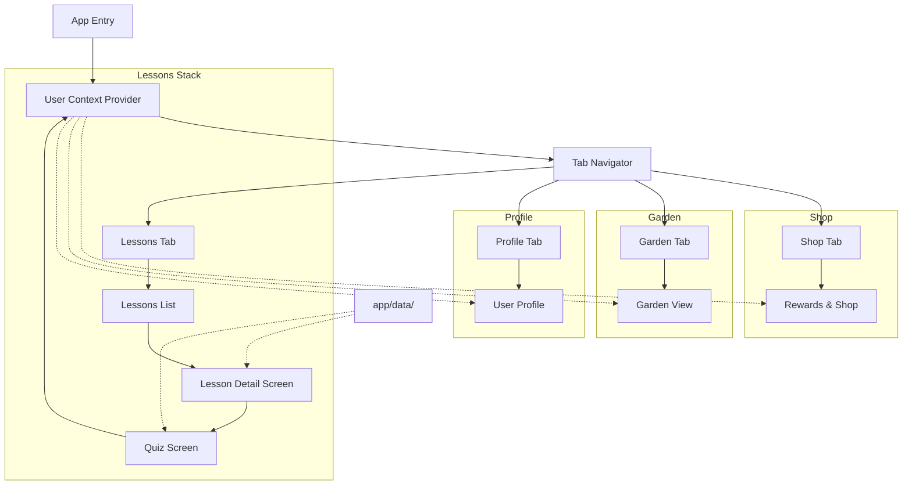

# Gemini Project Notes

This file is for tracking Gemini-related tasks, prompts, and documentation for the Papaya project. Use this file to pick up context between sessions.

## Current State (Jan 22, 2026)
- **App Status**: Functional. All lessons and quizzes working.
- **Recent Focus**: Project refactoring and Quiz UI redesign.

## Recent Changes
1.  **Quiz Screen Redesign**:
    *   Restyled with modern, clean UI (white background, pill-style options, blue accent button).
2.  **Project Refactoring**:
    *   **Data Extraction**: Moved quiz questions to `app/data/quizQuestions.ts` and lessons to `app/data/lessons.ts`.
    *   **Centralized Types**: Created `app/types/quiz.ts`, `app/types/lesson.ts`, and `app/types/garden.ts`.
    *   **Componentization**: Broke `QuizScreen` into reusable components (`QuizCard`, `QuizOptions`, `SeedAnimations`) in `app/components/quiz/`.
3.  **Build Fix**:
    *   Resolved `react-native-worklets` version mismatch by rebuilding native iOS app.

## Project Structure
```
app/
├── components/
│   └── quiz/           # Quiz-specific components
│       ├── QuizCard.tsx
│       ├── QuizOptions.tsx
│       └── SeedAnimations.tsx
├── contexts/
│   └── UserContext.tsx  # User state (seeds, garden, inventory)
├── data/
│   ├── contentData.tsx  # Lesson content text
│   ├── lessons.ts       # Lesson definitions
│   └── quizQuestions.ts # All quiz questions
├── screens/
│   ├── GardenScreen.tsx
│   ├── LessonDetailScreen.tsx
│   ├── LessonsScreen.tsx
│   ├── ProfileScreen.tsx
│   ├── QuizScreen.tsx
│   └── RewardsScreen.tsx
└── types/
    ├── garden.ts        # GardenItem, InventoryItem
    ├── lesson.ts        # Lesson
    └── quiz.ts          # Question, QuizData
```

## Next Steps / Backlog
- [ ] Consider restyling other screens to match new Quiz design.
- [ ] Add more quiz questions for new lessons.
- [ ] Review `LessonDetailScreen.tsx` for further componentization.

## App Overview

